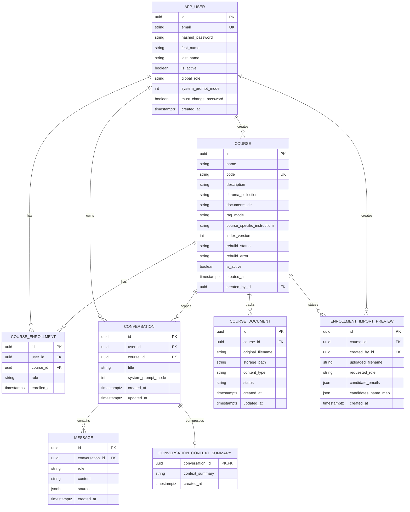

# Data Model

This document describes the PostgreSQL application schema used by the FastAPI backend.

Source of truth:

- Table models: `src/api/models/`
- Model registration: `src/api/models/__init__.py`
- Engine and startup DDL: `src/api/database.py`
- Business rules: `src/api/services/`

The application uses SQLModel on top of SQLAlchemy. `create_tables()` calls `SQLModel.metadata.create_all()` on startup and then applies a small set of manual `ALTER TABLE` statements for legacy columns and timestamp normalization.

## ER Diagram



## Tables

### `app_user`

Platform user account.

| Column | Type | Null | Notes |
|---|---:|---:|---|
| `id` | UUID | no | Primary key. |
| `email` | string | no | Unique indexed login identifier. |
| `hashed_password` | string | no | bcrypt hash. Imported users can initially have an empty hash with `must_change_password=true`. |
| `first_name` | string | no | Display/profile field. |
| `last_name` | string | no | Display/profile field. |
| `is_active` | boolean | no | Inactive users fail authentication. |
| `global_role` | string | no | `student`, `teacher`, or `admin`. Not enforced by a DB check constraint. |
| `system_prompt_mode` | integer | no | User preference: `1` Socratic, `2` Direct, `3` Example. Copied to new conversations. |
| `must_change_password` | boolean | no | Forces the user to change password before normal app access. |
| `created_at` | timestamptz | no | UTC timestamp. |

Indexes:

- `ix_app_user_email`, unique on `email`.

### `course`

Course record and active retrieval index pointer.

| Column | Type | Null | Notes |
|---|---:|---:|---|
| `id` | UUID | no | Primary key. |
| `name` | string | no | Human-readable course name. |
| `code` | string | no | Unique course code, used for material paths and scope names. |
| `description` | string | yes | Optional description. |
| `chroma_collection` | string | yes | Active Chroma collection and Neo4j graph scope. Null when no material index is active. |
| `documents_dir` | string | no | Course material directory path. |
| `rag_mode` | string | no | `kg_rag` or `naive_rag`. Not enforced by a DB check constraint. |
| `course_specific_instructions` | string | yes | Teacher-authored prompt instructions appended at response time. |
| `index_version` | integer | no | Monotonic version used for scoped material indexes, e.g. `TDT4186_v3`. |
| `rebuild_status` | string | no | `idle`, `queued`, `building`, or `failed`. Not enforced by a DB check constraint. |
| `rebuild_error` | string | yes | Last material rebuild error. |
| `is_active` | boolean | no | Present in the model. Course service code does not read this field. |
| `created_at` | timestamptz | no | UTC timestamp. |
| `created_by_id` | UUID | no | FK to `app_user.id`; creator is the course owner. |

Indexes:

- `ix_course_code`, unique on `code`.

Operational notes:

- `chroma_collection` is deliberately nullable. Courses can exist before materials are ingested.
- Startup DDL drops the old uniqueness constraint on `chroma_collection`.
- Deleting a course is handled in service code in FK-safe order.

### `course_enrollment`

Join table between users and courses with a course-local role.

| Column | Type | Null | Notes |
|---|---:|---:|---|
| `id` | UUID | no | Primary key. |
| `user_id` | UUID | no | FK to `app_user.id`. |
| `course_id` | UUID | no | FK to `course.id`. |
| `role` | string | no | `student` or `teacher`. Not enforced by a DB check constraint. |
| `enrolled_at` | timestamptz | no | UTC timestamp. |

Constraints:

- `uq_enrollment`, unique on `(user_id, course_id)`.

Meaning:

- `global_role` controls platform-level capabilities.
- `course_enrollment.role` controls permissions inside a specific course.

### `conversation`

Course-scoped chat session owned by a user.

| Column | Type | Null | Notes |
|---|---:|---:|---|
| `id` | UUID | no | Primary key. |
| `user_id` | UUID | no | FK to `app_user.id`; conversation owner. |
| `course_id` | UUID | no | FK to `course.id`; determines retrieval scope. |
| `title` | string | yes | Optional sidebar title. |
| `system_prompt_mode` | integer | no | Prompt mode fixed at conversation creation. |
| `created_at` | timestamptz | no | UTC timestamp. |
| `updated_at` | timestamptz | no | Updated on new messages and used for sorting. |

Notes:

- The prompt mode is copied from `app_user.system_prompt_mode` when the conversation is created.
- Only enrolled users can create a conversation for a course.

### `message`

Single chat turn in a conversation.

| Column | Type | Null | Notes |
|---|---:|---:|---|
| `id` | UUID | no | Primary key. |
| `conversation_id` | UUID | no | FK to `conversation.id`, `ON DELETE CASCADE`. |
| `role` | string | no | `human` or `ai`. Not enforced by a DB check constraint. |
| `content` | string | no | Message text. |
| `sources` | JSONB | yes | AI-only source references from retrieved chunks. |
| `created_at` | timestamptz | no | UTC timestamp. |

`sources` stores serialized chunk references, currently shaped like:

```json
[
  {
    "chunk_id": "string",
    "source_file": "filename.pdf",
    "page": "12"
  }
]
```

The source content itself is not stored in PostgreSQL. It is resolved later from Chroma by `chunk_id`.

### `conversation_context_summary`

One-to-one compressed summary for long conversations.

| Column | Type | Null | Notes |
|---|---:|---:|---|
| `conversation_id` | UUID | no | Primary key and FK to `conversation.id`, `ON DELETE CASCADE`. |
| `context_summary` | string | no | Compressed summary appended to the prompt. |
| `created_at` | timestamptz | no | UTC timestamp for the summary record/update baseline. |

Meaning:

- The table keeps prompt input bounded as message history grows.
- There is at most one summary row per conversation.

### `course_document`

Tracks uploaded or discovered course source files and their ingestion lifecycle.

| Column | Type | Null | Notes |
|---|---:|---:|---|
| `id` | UUID | no | Primary key. |
| `course_id` | UUID | no | FK to `course.id`, indexed. |
| `original_filename` | string | no | User-facing filename. |
| `storage_path` | string | no | Server-side file path. |
| `content_type` | string | yes | Upload content type when available. |
| `status` | string | no | `active`, `pending_add`, or `pending_remove`. Not enforced by a DB check constraint. |
| `created_at` | timestamptz | no | UTC timestamp. |
| `updated_at` | timestamptz | no | UTC timestamp. |

Indexes:

- `ix_course_document_course_id` on `course_id`.

Lifecycle:

- Uploads create `pending_add` rows.
- Deleting a `pending_add` document removes the file and row immediately.
- Deleting an `active` document changes status to `pending_remove`.
- Deleting a `pending_remove` document leaves the row unchanged.
- Confirming ingestion rebuilds the course material scope and activates/removes staged rows.

### `enrollment_import_preview`

Temporary staging table for CSV enrollment imports.

| Column | Type | Null | Notes |
|---|---:|---:|---|
| `id` | UUID | no | Primary key. |
| `course_id` | UUID | no | FK to `course.id`, indexed. |
| `created_by_id` | UUID | no | FK to `app_user.id`, indexed. |
| `uploaded_filename` | string | yes | Original CSV filename. |
| `requested_role` | string | no | Role to apply on confirm, normally `student`. |
| `candidate_emails` | JSON | no | Normalized email list accepted by preview parsing. |
| `candidates_name_map` | JSON | no | Email to parsed first/last name map. |
| `created_at` | timestamptz | no | UTC timestamp. |

Indexes:

- `ix_enrollment_import_preview_course_id` on `course_id`.
- `ix_enrollment_import_preview_created_by_id` on `created_by_id`.

Lifecycle:

- Preview creation removes previous previews for the same actor and course.
- Confirmation creates missing users with `must_change_password=true`, creates enrollments, then deletes the preview.
- Cancellation deletes the preview without mutating enrollments.

## External Data Stores

The application schema does not store all retrieval data in PostgreSQL.

| Store | Data | Link to PostgreSQL |
|---|---|---|
| ChromaDB | Embedded document chunks and chunk metadata. | `course.chroma_collection` names the active collection; `message.sources[].chunk_id` resolves stored chunks. |
| Neo4j | Entity nodes and `RELATED_TO` edges extracted from chunks. | Graph scope matches `course.chroma_collection`. Edge properties include `chunk_id`. |
| Filesystem | Uploaded source documents and course artifacts. | `course.documents_dir`, `course_document.storage_path`, and course artifact manifests. |

## Cascades and Deletion Behavior

Database-level cascade constraints:

| Foreign key | Database behavior |
|---|---|
| `course.created_by_id -> app_user.id` | No `ON DELETE` action defined. |
| `course_enrollment.user_id -> app_user.id` | No `ON DELETE` action defined. |
| `course_enrollment.course_id -> course.id` | No `ON DELETE` action defined. |
| `conversation.user_id -> app_user.id` | No `ON DELETE` action defined. |
| `conversation.course_id -> course.id` | No `ON DELETE` action defined. |
| `message.conversation_id -> conversation.id` | `ON DELETE CASCADE`. Deleting a conversation deletes its messages in PostgreSQL. |
| `conversation_context_summary.conversation_id -> conversation.id` | `ON DELETE CASCADE`. Deleting a conversation deletes its context summary in PostgreSQL. |
| `course_document.course_id -> course.id` | No `ON DELETE` action defined. |
| `enrollment_import_preview.course_id -> course.id` | No `ON DELETE` action defined. |
| `enrollment_import_preview.created_by_id -> app_user.id` | No `ON DELETE` action defined. |

Service-level deletion:

- Course deletion manually deletes messages, conversations, course materials, enrollments, and the course in `src/api/services/courses.py`.
- Course material purge deletes related `course_document` rows and clears external Chroma/Neo4j scopes in `src/api/services/course_documents.py`.
- Conversation deletion uses `db.delete(conversation)` in `src/api/services/conversations.py`; PostgreSQL cascades dependent `message` and `conversation_context_summary` rows.

Implication:

- Deleting a `course` directly in PostgreSQL can fail while dependent rows exist, because course-related foreign keys do not define database cascade actions.
- Use the service-level course deletion path when deleting a course so PostgreSQL rows, Chroma collections, Neo4j scopes, and material files are cleaned up together.

## Schema Evolution Notes

- There is no project Alembic migration directory in the repository.
- Startup applies compatibility DDL in `src/api/database.py`, including:
  - adding `system_prompt_mode` to `app_user` and `conversation`;
  - adding course instruction, RAG mode, index version, rebuild status, and rebuild error columns;
  - allowing `course.chroma_collection` to be nullable;
  - dropping the old `course_chroma_collection_key` constraint;
  - adding `must_change_password` to `app_user`;
  - converting known timestamp columns to timezone-aware timestamps when needed.
- Enum-like values are implemented as strings or integers without database check constraints. Validation is handled by schemas and service code.
