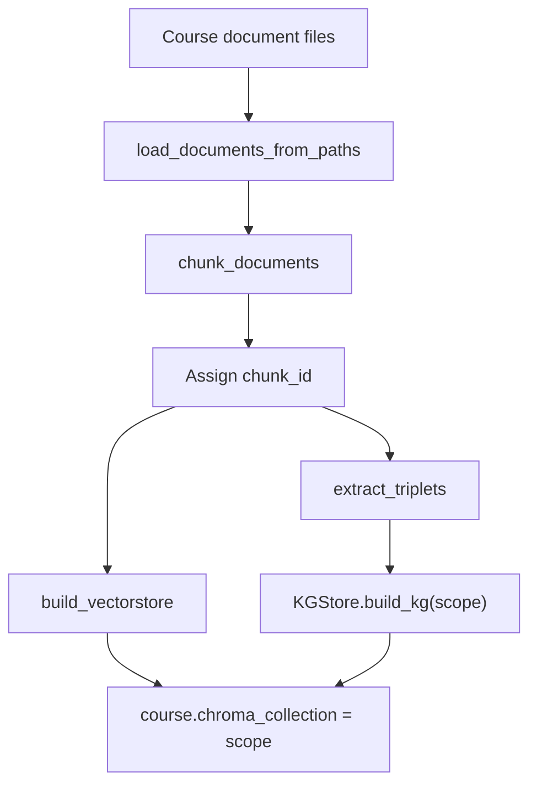
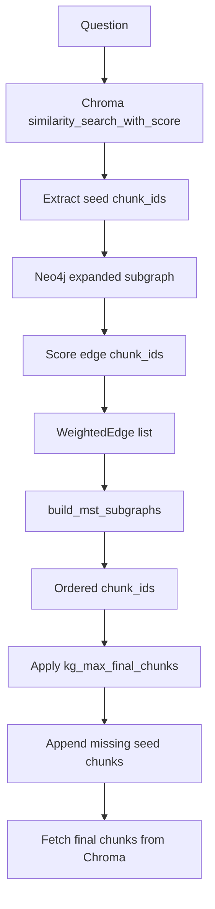

# KG2RAG

`kg_rag` combines vector retrieval from ChromaDB with graph expansion from Neo4j.

Source files:

- Chain: `src/chain/kg_rag_chain.py`
- Retriever: `src/kg/retriever.py`
- Graph store: `src/kg/store.py`
- Triplet extraction: `src/kg/extractor.py`
- MST filtering: `src/kg/organizer.py`
- Course rebuild: `src/api/services/course_documents.py`

## Stored Graph Shape

Neo4j stores entities and relations extracted from document chunks.

```text
(:Entity {scope, name})-[:RELATED_TO {scope, relation, chunk_id}]->(:Entity {scope, name})
```

`scope` is the active course material scope. It matches `course.chroma_collection`.

Chunks are not Neo4j nodes. Graph edges carry `chunk_id`, which links back to Chroma.

## Build-Time Flow

KG data is built during course material rebuild when `course.rag_mode == "kg_rag"`.



When `course.rag_mode == "naive_rag"`, the rebuild still creates the Chroma collection and skips KG extraction/building.

## Query-Time Flow

`KGExpandedRetriever._get_relevant_documents()` performs the retrieval.



## Retrieval Steps

| Step | Implementation |
|---|---|
| Seed retrieval | Chroma `similarity_search_with_score(query, k=retriever_top_k)`. |
| Seed IDs | Read `chunk_id` metadata from seed documents. |
| Graph expansion | `KGStore.get_expanded_subgraph(seed_ids, scope=graph_scope)`. |
| Seed scoring | Convert Chroma distance to `1 / (1 + distance)`. |
| Expanded chunk scoring | Query Chroma for graph chunk IDs not already scored. |
| Edge weighting | Attach chunk similarity score to each graph edge. |
| Filtering | `build_mst_subgraphs()` returns MST-filtered connected components. |
| Final limit | Keep at most `kg_max_final_chunks`. |
| Final fetch | Read final chunks from Chroma by `chunk_id`. |

## Fallbacks

The retriever returns seed documents when:

- seed documents contain no `chunk_id`;
- graph expansion returns no edges;
- MST filtering returns no chunk IDs;
- score limiting removes all chunk IDs.

These fallbacks are implemented in `KGExpandedRetriever._get_relevant_documents()`.

## Scope Lifecycle

Course rebuild creates a new scope named from course code and index version.

Example:

```text
TDT4186_v3
```

On successful rebuild:

- `course.index_version` is incremented;
- `course.chroma_collection` is set to the new scope;
- old scope cleanup runs after the database commit.

On failed rebuild:

- `course.rebuild_status` becomes `failed`;
- `course.rebuild_error` stores a truncated error message;
- the failed target scope is cleaned up before activation.

## Settings

| Setting | Use |
|---|---|
| `retriever_top_k` | Number of Chroma seed chunks for KG retrieval. |
| `kg_expansion_hops` | Neo4j traversal depth from seed entities. |
| `kg_max_final_chunks` | Maximum final chunks passed to the prompt. |
| `neo4j_uri`, `neo4j_user`, `neo4j_password` | Neo4j connection settings. |

## Data Ownership

| Data | Owner |
|---|---|
| Active scope pointer | PostgreSQL `course.chroma_collection`. |
| Chunk text and metadata | Chroma collection named by scope. |
| Entity graph | Neo4j entities and `RELATED_TO` edges with matching scope. |
| Source document records | PostgreSQL `course_document`. |
