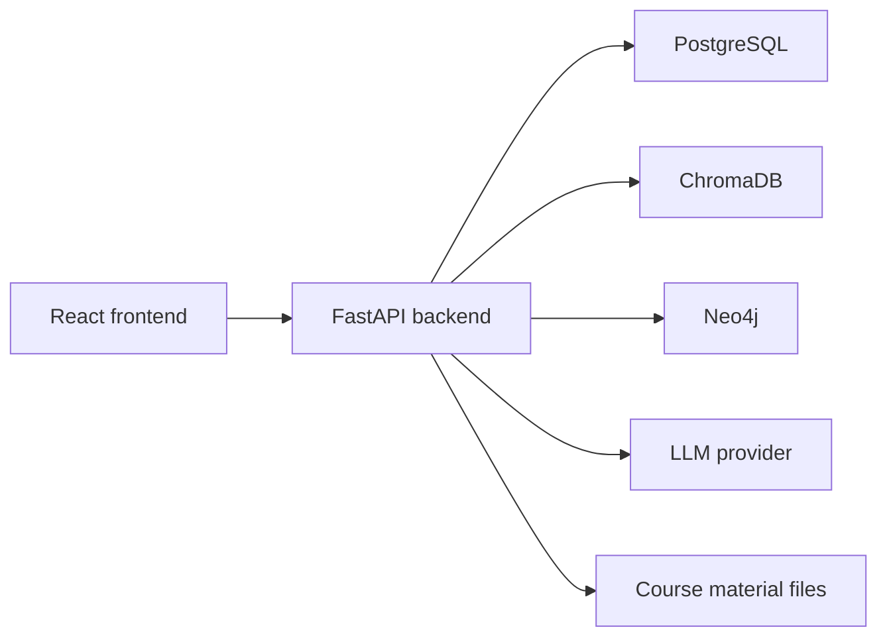
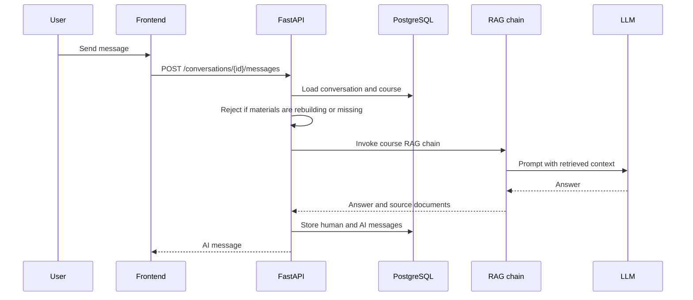

# Architecture Overview

Pensum Piloten is a course-scoped RAG chat application. Users authenticate through the frontend, select a course, create a conversation, and send messages. The backend retrieves context from the selected course material before calling the configured LLM.

## Components

| Component | Responsibility | Source |
|---|---|---|
| React frontend | Routes, auth state, chat UI, course management UI. | `frontend/src/` |
| FastAPI backend | HTTP API, auth, course workflows, conversations, RAG invocation. | `src/api/` |
| PostgreSQL | Users, courses, enrollments, conversations, messages, material metadata. | `src/api/models/` |
| ChromaDB | Embedded document chunks per active course scope. | `src/vectorstore/` |
| Neo4j | Entity graph for `kg_rag` course scopes. | `src/kg/` |
| Filesystem | Uploaded course documents and rebuild artifacts. | `data/documents/` |
| LLM provider | Chat responses and KG triplet extraction. | `src/models.py` |

## Backend Startup

Startup is defined in `src/api/app.py`.

1. `init_engine()` initializes the async SQLAlchemy engine.
2. `create_tables()` creates SQLModel tables and applies compatibility DDL.
3. `ensure_admin_user()` creates or updates the configured admin account when `ADMIN_EMAIL` and `ADMIN_PASSWORD` are set.
4. `seed()` runs only when `seed_test_data` is enabled.
5. Routers are mounted for auth, admin, courses, conversations, and preferences.

The health endpoint is `GET /health`.

## Course Chat Flow

Relevant code:

- Message API: `src/api/routers/conversations.py`
- Message service: `src/api/services/messages.py`
- RAG chains: `src/chain/kg_rag_chain.py`, `src/chain/naive_rag_chain.py`

## Course Material Flow

Course materials are staged before they become active.

1. Teachers upload files or zip archives.
2. Backend creates `course_document` rows with staged statuses.
3. Teacher confirms ingestion.
4. Backend sets `course.rebuild_status` to `queued`.
5. Background task builds a new Chroma collection and, for `kg_rag`, a Neo4j graph scope.
6. On success, `course.chroma_collection` and `course.index_version` are updated.
7. Old retrieval scope cleanup runs after the new scope is active.

Relevant code:

- Course material service: `src/api/services/course_documents.py`
- Course routes: `src/api/routers/courses.py`
- Loader/chunker/vector store: `src/ingestion/`, `src/vectorstore/`

## Model Providers

`src/models.py` selects providers by `model_provider`.

| `model_provider` | Chat model | Embeddings |
|---|---|---|
| `openai` | OpenAI chat model | OpenAI embeddings |
| `anthropic` | Anthropic chat model | OpenAI embeddings |

KG extraction uses `get_ingestion_llm()`. With `model_provider="openai"`, it uses `openai_ingestion_model`. With `model_provider="anthropic"`, it uses `anthropic_ingestion_model`.

## Data Boundaries

PostgreSQL stores application state. It does not store embedded chunk content, Neo4j graph edges, or source files.

| Data | Store |
|---|---|
| Users, courses, enrollments, conversations, messages | PostgreSQL |
| Chunk text, embeddings, chunk metadata | ChromaDB |
| Extracted entities and relations | Neo4j |
| Uploaded files and rebuild artifacts | Filesystem |

See `docs/architecture/data-model.md` for the database schema.
