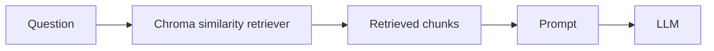
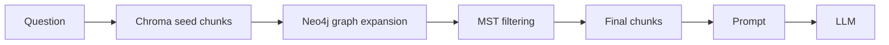

# RAG Pipeline

The RAG pipeline runs when a human message is posted to a course conversation.

Source files:

- `src/api/services/messages.py`
- `src/chain/kg_rag_chain.py`
- `src/chain/naive_rag_chain.py`
- `src/prompts/templates.py`
- `src/vectorstore/store.py`

## Message Preconditions

`create_message()` checks the course before invoking a chain.

| Condition | Result |
|---|---|
| Course row is missing | 404 error. |
| `course.rebuild_status` is `queued` or `building` | 409 error. |
| `course.chroma_collection` is null | 400 error. |
| `course.rag_mode` is not `kg_rag` or `naive_rag` | 400 staged chain configuration error. |

## Chain Selection

Chains are cached in memory by `(rag_mode, scope)`, where `scope` is `course.chroma_collection`.

| `course.rag_mode` | Chain builder |
|---|---|
| `kg_rag` | `build_kg_rag_chain(chroma_collection=scope, graph_scope=scope)` |
| `naive_rag` | `build_naive_rag_chain(chroma_collection=scope)` |

## Runtime Inputs

The backend passes these fields to the selected chain:

| Field | Source |
|---|---|
| `question` | Current human message. |
| `chat_history` | Conversation messages after the current compression summary timestamp. |
| `system_prompt_mode` | `conversation.system_prompt_mode`. |
| `course_specific_instructions` | `course.course_specific_instructions`. |
| `conversation_summary` | `conversation_context_summary.context_summary`, when present. |

## Prompt Construction

Both RAG modes use `build_tutor_prompt()`.

The prompt includes:

- base educational assistant constraints;
- selected prompt mode instructions;
- course-specific instructions when configured;
- compressed conversation summary when present;
- formatted retrieved context;
- chat history;
- current question.

Prompt modes are resolved by `resolve_system_prompt_mode()`:

| Value | Mode |
|---:|---|
| `1` | Socratic |
| `2` | Direct |
| `3` | Example |

Invalid values fall back to Socratic mode.

## Retrieval Modes

### `naive_rag`

`naive_rag` uses Chroma similarity retrieval only.

The number of chunks is controlled by `naive_rag_top_k`.

### `kg_rag`

`kg_rag` uses Chroma seed retrieval followed by Neo4j graph expansion.

See `docs/architecture/kg2rag.md` for the KG2RAG retrieval steps.

## Response Persistence

On a successful human turn:

1. The backend receives chain output: `answer` and `source_documents`.
2. Retrieved source documents are serialized to `chunk_id`, `source_file`, and `page`.
3. The human message and AI message are committed in one database transaction.
4. `conversation.updated_at` is updated.
5. The API returns the AI message.

Human message persistence and AI response persistence are handled in the same service method.

## Source Resolution

AI message rows store source references in `message.sources`.

The source panel does not read source text from PostgreSQL. It resolves chunks from Chroma by `chunk_id`.

Relevant code:

- Serialization: `src/api/services/messages.py`
- Source lookup: `src/api/services/message_sources.py`
- Chroma lookup: `src/vectorstore/store.py`

## Conversation Compression

Conversation compression is checked before chain invocation.

| Setting | Meaning |
|---|---|
| `conversation_compression_token_limit` | Token estimate threshold for compression. |

If the estimate exceeds the limit:

1. Existing raw messages after the last summary are formatted as a transcript.
2. The LLM creates or updates a summary.
3. The summary is stored in `conversation_context_summary`.
4. Only messages newer than the summary timestamp are included as raw `chat_history`.

